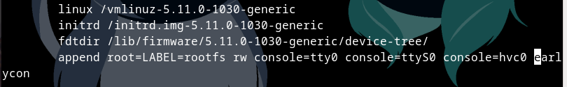
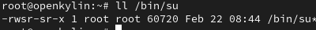
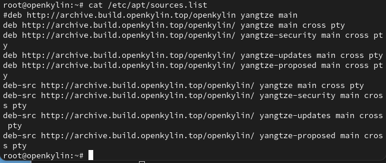

# autopkgtest在各种linux操作系统的初步部署
已验证环境：debian11 ， archlinux

测试镜像：openkylin
## testbed设置
参考[使用Qemu启动openKylin](https://docs.openkylin.top/zh/%E7%A4%BE%E5%8C%BA%E5%BC%80%E5%8F%91%E6%8C%87%E5%8D%97/riscv%E4%B8%8A%E5%AE%89%E8%A3%85openKylin#%E4%BA%94-%E4%BD%BF%E7%94%A8qemu%E5%90%AF%E5%8A%A8openkylin)启动qemu镜像以及[启动后配置](https://github.com/KotorinMinami/plct-working/tree/main/openKylin#%E5%90%AF%E5%8A%A8%E5%90%8E%E9%85%8D%E7%BD%AE)初步配置openkylin后(需要使用qemu-img convert，autopkgtest默认使用qcow2的镜像，创建完后可以先创建快照并在快照中进行下一步)，root身份进入guest，密码与启动后配置文章叙述一致，由于默认/boot分区为已读挂载，故需要从新挂载
```
mount -o remount rw /boot
```
更改/boot/extlinux/extlinux.conf
```
vi /boot/extlinux/extlinux.conf
```
在第一个label下的append一行加入`console=tty0 console=ttyS0 console=hvc0`，如：



然后重启，手动更新系统(自动apt upgrade会导致mount被更新，然后mount还有bug,导致/boot分区无法正确挂载，更改的内核参数全部木大，不更新则会导致autopkgtest提示版本过低，目前将mount外软件批量更新后可正常使用)
```
apt update
apt list --upgradable | grep -v mount | awk -F/ ‘{print$1}' > apt_list 
```
这样需要更新的软件包名称就列在apt_list中了，循环或是一次性全安装都可以，更新时间较长，可以去准备其他的东西，如host里软件的安装。
更新后其实还有几个有问题无法安装，无需理会，此时需要对/bin/su进行所有者的矫正(更新后歪了，能矫正所以没去找是那个整歪的)
```
chown -R root:root /bin/su
chmod a+s /bin/su
# 最后看看效果
ll /bin/su
```
如下



更改完后就是最后一步，guest运行对应[脚本](./setup-commands/setup_testbed_u_boot.sh)，将autopkgtest需要的配置进一步配好。运行脚本注意的地方有，apt仓库如若以及配置了deb-src仓库选项
如：



请将deb-src开头的行给删掉，在使用bash运行脚本时，需要声明UPGRADE=false，即
```
export UPGRADE=false
bash setup_testbed_u_boot.sh
```
自此，testbed设置完成

## autopkgtest及其依赖的安装
### debian系
可直接使用`apt install autopkgtest -y`安装
### 非debian系或有自定义安装位置的需求
安装对应依赖，以Arch为例：（red hat系至少fedora有对应的包的记载）
```
pacman -Syu dpkg python-debian make install
```
clone本仓库或debian[源码仓库](https://salsa.debian.org/ci-team/autopkgtest.git)
进入仓库目录后：
```
export DESTDIR= （等号后为你想安装autopkgtest的位置，）此行不填则会安装至/usr文件夹，且需要sudo
make all && sudo make install
```
运行完成后部署基本完成
## 运行
使用以下的命令使得autopkgtest可以识别并正确启动openkylin镜像：
```
sudo autopkgtest systemd_245.4-4ubuntu3.19.dsc -o test -d \
-- qemu -o ../img -u root -p ubuntukylin --qemu-architecture=riscv64 \
-c 4 --ram-size=4096 -d \ 
--qemu-options='-machine virt -kernel /home/minami/Documents/ukylin/u-boot.bin' \
../test.qcow2
```
详情：
- .dsc文件为测试使用的文件，可事先从guest中使用`apt-get source systemd`命令获得
- -o为输出目录，-d为显示debug级别的信息
- qemu -o 后为备份镜像存放地址
- --qemu-architecture决定镜像架构
- --qemu-options决定qemu启动时附加的命令行参数
- qcow2文件为镜像文件

## 自动化对应思路
- 将准备的镜像拷贝两份，一份为source,正常启动并使用ssh获取openkylin对应软件源的源码包
- 另一份作为autopkgtest的镜像文件
- 其中[auto.sh](./auto.sh)即实现运行测试例，筛选功能，手动调整部分为启动source镜像，选择一个没有被占用的端口并输入auto.sh,同时需要保证source镜像内/root文件夹为空。apt_list为待测的软件包的列表，install_dist为你安装autopkgtest时的DESTDIR，workdir为autopkgtest使用镜像所在位置，img为对应镜像名， 总的使用格式如下
```
bash auto.sh port apt_list workdir img install_dist
```
注意u-boot镜像也要在workdir中,
运行结束后会产生pkg_no_souce , pkg_no_test 与 pkg_finish列表，只做计数用。
测试结果会在testing文件夹中
